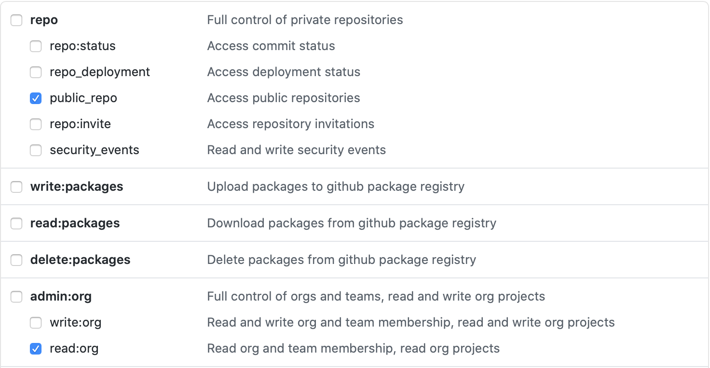

# conda-forge-contribution
[](https://github.com/jan-janssen/conda-forge-contribution/actions)

This repository allows you to quickly generate a list of all your [conda-forge](https://conda-forge.org) contributions.

For example the contributions of [jan-janssen](https://github.com/jan-janssen) are available at [https://jan-janssen.github.io/conda-forge-contribution/](https://jan-janssen.github.io/conda-forge-contribution/).

To generate your own contribution-list, simply fork this repository and set the environment variable `GH_TOKEN` as a [github action secret](https://docs.github.com/en/actions/reference/encrypted-secrets#creating-encrypted-secrets-for-a-repository):

```
GH_TOKEN = <your Github token which enables access to public_repo and read:org>
```

For the token the following permissions are required:


After creating the environment variable `GH_TOKEN` trigger a new build on the master branch. 

Designed by [colorlib](https://colorlib.com/wp/template/responsive-table-v2/).
# List of Packages 

| Package Name | Downloads |
|:-------------|:---------:|
| [h5py](https://anaconda.org/conda-forge/h5py) | [](https://anaconda.org/conda-forge/h5py) |
| [pyparsing](https://anaconda.org/conda-forge/pyparsing) | [](https://anaconda.org/conda-forge/pyparsing) |
| [phonenumbers](https://anaconda.org/conda-forge/phonenumbers) | [](https://anaconda.org/conda-forge/phonenumbers) |
| [mutagen](https://anaconda.org/conda-forge/mutagen) | [](https://anaconda.org/conda-forge/mutagen) |
| [pymongo](https://anaconda.org/conda-forge/pymongo) | [](https://anaconda.org/conda-forge/pymongo) |
| [oauthlib](https://anaconda.org/conda-forge/oauthlib) | [](https://anaconda.org/conda-forge/oauthlib) |
| [pydruid](https://anaconda.org/conda-forge/pydruid) | [](https://anaconda.org/conda-forge/pydruid) |
| [flask-oauthlib](https://anaconda.org/conda-forge/flask-oauthlib) | [](https://anaconda.org/conda-forge/flask-oauthlib) |
| [pytrie](https://anaconda.org/conda-forge/pytrie) | [](https://anaconda.org/conda-forge/pytrie) |
| [voluptuous](https://anaconda.org/conda-forge/voluptuous) | [](https://anaconda.org/conda-forge/voluptuous) |
| [girder-client](https://anaconda.org/conda-forge/girder-client) | [](https://anaconda.org/conda-forge/girder-client) |
| [girder](https://anaconda.org/conda-forge/girder) | [](https://anaconda.org/conda-forge/girder) |
| [scandir](https://anaconda.org/conda-forge/scandir) | [](https://anaconda.org/conda-forge/scandir) |
| [f90wrap](https://anaconda.org/conda-forge/f90wrap) | [](https://anaconda.org/conda-forge/f90wrap) |
| [speechrecognition](https://anaconda.org/conda-forge/speechrecognition) | [](https://anaconda.org/conda-forge/speechrecognition) |
| [qds-sdk](https://anaconda.org/conda-forge/qds-sdk) | [](https://anaconda.org/conda-forge/qds-sdk) |
| [cement](https://anaconda.org/conda-forge/cement) | [](https://anaconda.org/conda-forge/cement) |
| [tldextract](https://anaconda.org/conda-forge/tldextract) | [](https://anaconda.org/conda-forge/tldextract) |
| [wtf-peewee](https://anaconda.org/conda-forge/wtf-peewee) | [](https://anaconda.org/conda-forge/wtf-peewee) |
| [cloudant](https://anaconda.org/conda-forge/cloudant) | [](https://anaconda.org/conda-forge/cloudant) |
| [imapclient](https://anaconda.org/conda-forge/imapclient) | [](https://anaconda.org/conda-forge/imapclient) |
| [flask-seasurf](https://anaconda.org/conda-forge/flask-seasurf) | [](https://anaconda.org/conda-forge/flask-seasurf) |
| [flask-restful](https://anaconda.org/conda-forge/flask-restful) | [](https://anaconda.org/conda-forge/flask-restful) |
| [flask-user](https://anaconda.org/conda-forge/flask-user) | [](https://anaconda.org/conda-forge/flask-user) |
| [creoleparser](https://anaconda.org/conda-forge/creoleparser) | [](https://anaconda.org/conda-forge/creoleparser) |
| [zodburi](https://anaconda.org/conda-forge/zodburi) | [](https://anaconda.org/conda-forge/zodburi) |
| [sseclient](https://anaconda.org/conda-forge/sseclient) | [](https://anaconda.org/conda-forge/sseclient) |
| [flask-moment](https://anaconda.org/conda-forge/flask-moment) | [](https://anaconda.org/conda-forge/flask-moment) |
| [flask-cors](https://anaconda.org/conda-forge/flask-cors) | [](https://anaconda.org/conda-forge/flask-cors) |
| [zodbpickle](https://anaconda.org/conda-forge/zodbpickle) | [](https://anaconda.org/conda-forge/zodbpickle) |
| [dominate](https://anaconda.org/conda-forge/dominate) | [](https://anaconda.org/conda-forge/dominate) |
| [flask-debugtoolbar](https://anaconda.org/conda-forge/flask-debugtoolbar) | [](https://anaconda.org/conda-forge/flask-debugtoolbar) |
| [msg-extractor](https://anaconda.org/conda-forge/msg-extractor) | [](https://anaconda.org/conda-forge/msg-extractor) |
| [flask-flatpages](https://anaconda.org/conda-forge/flask-flatpages) | [](https://anaconda.org/conda-forge/flask-flatpages) |
| [textract](https://anaconda.org/conda-forge/textract) | [](https://anaconda.org/conda-forge/textract) |
| [census](https://anaconda.org/conda-forge/census) | [](https://anaconda.org/conda-forge/census) |
| [zconfig](https://anaconda.org/conda-forge/zconfig) | [](https://anaconda.org/conda-forge/zconfig) |
| [flask-migrate](https://anaconda.org/conda-forge/flask-migrate) | [](https://anaconda.org/conda-forge/flask-migrate) |
| [fenics](https://anaconda.org/conda-forge/fenics) | [](https://anaconda.org/conda-forge/fenics) |
| [petsc](https://anaconda.org/conda-forge/petsc) | [](https://anaconda.org/conda-forge/petsc) |
| [phonopy](https://anaconda.org/conda-forge/phonopy) | [](https://anaconda.org/conda-forge/phonopy) |
| [monty](https://anaconda.org/conda-forge/monty) | [](https://anaconda.org/conda-forge/monty) |
| [mshr](https://anaconda.org/conda-forge/mshr) | [](https://anaconda.org/conda-forge/mshr) |
| [leather](https://anaconda.org/conda-forge/leather) | [](https://anaconda.org/conda-forge/leather) |
| [agate](https://anaconda.org/conda-forge/agate) | [](https://anaconda.org/conda-forge/agate) |
| [agate-dbf](https://anaconda.org/conda-forge/agate-dbf) | [](https://anaconda.org/conda-forge/agate-dbf) |
| [agate-sql](https://anaconda.org/conda-forge/agate-sql) | [](https://anaconda.org/conda-forge/agate-sql) |
| [csvkit](https://anaconda.org/conda-forge/csvkit) | [](https://anaconda.org/conda-forge/csvkit) |
| [kafkacat](https://anaconda.org/conda-forge/kafkacat) | [](https://anaconda.org/conda-forge/kafkacat) |
| [rope](https://anaconda.org/conda-forge/rope) | [](https://anaconda.org/conda-forge/rope) |
| [rednose](https://anaconda.org/conda-forge/rednose) | [](https://anaconda.org/conda-forge/rednose) |
| [waybackpack](https://anaconda.org/conda-forge/waybackpack) | [](https://anaconda.org/conda-forge/waybackpack) |
| [markovify](https://anaconda.org/conda-forge/markovify) | [](https://anaconda.org/conda-forge/markovify) |
| [jieba](https://anaconda.org/conda-forge/jieba) | [](https://anaconda.org/conda-forge/jieba) |
| [jaraco.logging](https://anaconda.org/conda-forge/jaraco.logging) | [](https://anaconda.org/conda-forge/jaraco.logging) |
| [jaraco.stream](https://anaconda.org/conda-forge/jaraco.stream) | [](https://anaconda.org/conda-forge/jaraco.stream) |
| [records](https://anaconda.org/conda-forge/records) | [](https://anaconda.org/conda-forge/records) |
| [lesscpy](https://anaconda.org/conda-forge/lesscpy) | [](https://anaconda.org/conda-forge/lesscpy) |
| [twython](https://anaconda.org/conda-forge/twython) | [](https://anaconda.org/conda-forge/twython) |
| [transaction](https://anaconda.org/conda-forge/transaction) | [](https://anaconda.org/conda-forge/transaction) |
| [zodb](https://anaconda.org/conda-forge/zodb) | [](https://anaconda.org/conda-forge/zodb) |
| [zeo](https://anaconda.org/conda-forge/zeo) | [](https://anaconda.org/conda-forge/zeo) |
| [google-auth](https://anaconda.org/conda-forge/google-auth) | [](https://anaconda.org/conda-forge/google-auth) |
| [google-auth-oauthlib](https://anaconda.org/conda-forge/google-auth-oauthlib) | [](https://anaconda.org/conda-forge/google-auth-oauthlib) |
| [dicttoxml](https://anaconda.org/conda-forge/dicttoxml) | [](https://anaconda.org/conda-forge/dicttoxml) |
| [moto](https://anaconda.org/conda-forge/moto) | [](https://anaconda.org/conda-forge/moto) |
| [pyperclip](https://anaconda.org/conda-forge/pyperclip) | [](https://anaconda.org/conda-forge/pyperclip) |
| [furl](https://anaconda.org/conda-forge/furl) | [](https://anaconda.org/conda-forge/furl) |
| [pyside2](https://anaconda.org/conda-forge/pyside2) | [](https://anaconda.org/conda-forge/pyside2) |
| [infinity](https://anaconda.org/conda-forge/infinity) | [](https://anaconda.org/conda-forge/infinity) |
| [intervals](https://anaconda.org/conda-forge/intervals) | [](https://anaconda.org/conda-forge/intervals) |
| [dnspython](https://anaconda.org/conda-forge/dnspython) | [](https://anaconda.org/conda-forge/dnspython) |
| [langdetect](https://anaconda.org/conda-forge/langdetect) | [](https://anaconda.org/conda-forge/langdetect) |
| [dotmap](https://anaconda.org/conda-forge/dotmap) | [](https://anaconda.org/conda-forge/dotmap) |
| [plac](https://anaconda.org/conda-forge/plac) | [](https://anaconda.org/conda-forge/plac) |
| [aenum](https://anaconda.org/conda-forge/aenum) | [](https://anaconda.org/conda-forge/aenum) |
| [scrypt](https://anaconda.org/conda-forge/scrypt) | [](https://anaconda.org/conda-forge/scrypt) |
| [siesta](https://anaconda.org/conda-forge/siesta) | [](https://anaconda.org/conda-forge/siesta) |
| [oletools](https://anaconda.org/conda-forge/oletools) | [](https://anaconda.org/conda-forge/oletools) |
| [h5io](https://anaconda.org/conda-forge/h5io) | [](https://anaconda.org/conda-forge/h5io) |
| [python-box](https://anaconda.org/conda-forge/python-box) | [](https://anaconda.org/conda-forge/python-box) |
| [pyiron](https://anaconda.org/conda-forge/pyiron) | [](https://anaconda.org/conda-forge/pyiron) |
| [pyiron_atomistics](https://anaconda.org/conda-forge/pyiron_atomistics) | [](https://anaconda.org/conda-forge/pyiron_atomistics) |
| [pyiron_base](https://anaconda.org/conda-forge/pyiron_base) | [](https://anaconda.org/conda-forge/pyiron_base) |
| [pyiron_dft](https://anaconda.org/conda-forge/pyiron_dft) | [](https://anaconda.org/conda-forge/pyiron_dft) |
| [pyiron_example_job](https://anaconda.org/conda-forge/pyiron_example_job) | [](https://anaconda.org/conda-forge/pyiron_example_job) |
| [pyiron_lammps](https://anaconda.org/conda-forge/pyiron_lammps) | [](https://anaconda.org/conda-forge/pyiron_lammps) |
| [pyiron_vasp](https://anaconda.org/conda-forge/pyiron_vasp) | [](https://anaconda.org/conda-forge/pyiron_vasp) |
| [lammps](https://anaconda.org/conda-forge/lammps) | [](https://anaconda.org/conda-forge/lammps) |
| [libsigsegv](https://anaconda.org/conda-forge/libsigsegv) | [](https://anaconda.org/conda-forge/libsigsegv) |
| [ovito](https://anaconda.org/conda-forge/ovito) | [](https://anaconda.org/conda-forge/ovito) |
| [python-crontab](https://anaconda.org/conda-forge/python-crontab) | [](https://anaconda.org/conda-forge/python-crontab) |
| [simpletraj](https://anaconda.org/conda-forge/simpletraj) | [](https://anaconda.org/conda-forge/simpletraj) |
| [atomsk](https://anaconda.org/conda-forge/atomsk) | [](https://anaconda.org/conda-forge/atomsk) |
| [astral](https://anaconda.org/conda-forge/astral) | [](https://anaconda.org/conda-forge/astral) |
| [python-flint](https://anaconda.org/conda-forge/python-flint) | [](https://anaconda.org/conda-forge/python-flint) |
| [bcrypt](https://anaconda.org/conda-forge/bcrypt) | [](https://anaconda.org/conda-forge/bcrypt) |
| [pysqa](https://anaconda.org/conda-forge/pysqa) | [](https://anaconda.org/conda-forge/pysqa) |
| [codacy-coverage](https://anaconda.org/conda-forge/codacy-coverage) | [](https://anaconda.org/conda-forge/codacy-coverage) |
| [libxc](https://anaconda.org/conda-forge/libxc) | [](https://anaconda.org/conda-forge/libxc) |
| [dtool_s3](https://anaconda.org/conda-forge/dtool_s3) | [](https://anaconda.org/conda-forge/dtool_s3) |
| [dtool_http](https://anaconda.org/conda-forge/dtool_http) | [](https://anaconda.org/conda-forge/dtool_http) |
| [dtool_cli](https://anaconda.org/conda-forge/dtool_cli) | [](https://anaconda.org/conda-forge/dtool_cli) |
| [dtool_create](https://anaconda.org/conda-forge/dtool_create) | [](https://anaconda.org/conda-forge/dtool_create) |
| [dtoolcore](https://anaconda.org/conda-forge/dtoolcore) | [](https://anaconda.org/conda-forge/dtoolcore) |
| [dtool_info](https://anaconda.org/conda-forge/dtool_info) | [](https://anaconda.org/conda-forge/dtool_info) |
| [dtool_symlink](https://anaconda.org/conda-forge/dtool_symlink) | [](https://anaconda.org/conda-forge/dtool_symlink) |
| [dtool_config](https://anaconda.org/conda-forge/dtool_config) | [](https://anaconda.org/conda-forge/dtool_config) |
| [dtool](https://anaconda.org/conda-forge/dtool) | [](https://anaconda.org/conda-forge/dtool) |
| [gpaw](https://anaconda.org/conda-forge/gpaw) | [](https://anaconda.org/conda-forge/gpaw) |
| [catlearn](https://anaconda.org/conda-forge/catlearn) | [](https://anaconda.org/conda-forge/catlearn) |
| [pylops](https://anaconda.org/conda-forge/pylops) | [](https://anaconda.org/conda-forge/pylops) |
| [scikit-fmm](https://anaconda.org/conda-forge/scikit-fmm) | [](https://anaconda.org/conda-forge/scikit-fmm) |
| [libssh](https://anaconda.org/conda-forge/libssh) | [](https://anaconda.org/conda-forge/libssh) |
| [cabextract](https://anaconda.org/conda-forge/cabextract) | [](https://anaconda.org/conda-forge/cabextract) |
| [mscorefonts](https://anaconda.org/conda-forge/mscorefonts) | [](https://anaconda.org/conda-forge/mscorefonts) |
| [cm-unicode](https://anaconda.org/conda-forge/cm-unicode) | [](https://anaconda.org/conda-forge/cm-unicode) |
| [randspg](https://anaconda.org/conda-forge/randspg) | [](https://anaconda.org/conda-forge/randspg) |
| [seekpath](https://anaconda.org/conda-forge/seekpath) | [](https://anaconda.org/conda-forge/seekpath) |
| [icet](https://anaconda.org/conda-forge/icet) | [](https://anaconda.org/conda-forge/icet) |
| [mendeleev](https://anaconda.org/conda-forge/mendeleev) | [](https://anaconda.org/conda-forge/mendeleev) |
| [custodian](https://anaconda.org/conda-forge/custodian) | [](https://anaconda.org/conda-forge/custodian) |
| [molmod](https://anaconda.org/conda-forge/molmod) | [](https://anaconda.org/conda-forge/molmod) |
| [pymatgen](https://anaconda.org/conda-forge/pymatgen) | [](https://anaconda.org/conda-forge/pymatgen) |
| [yaff](https://anaconda.org/conda-forge/yaff) | [](https://anaconda.org/conda-forge/yaff) |
| [sqsgenerator](https://anaconda.org/conda-forge/sqsgenerator) | [](https://anaconda.org/conda-forge/sqsgenerator) |
| [sharedarray](https://anaconda.org/conda-forge/sharedarray) | [](https://anaconda.org/conda-forge/sharedarray) |
| [scisweeper](https://anaconda.org/conda-forge/scisweeper) | [](https://anaconda.org/conda-forge/scisweeper) |
| [pyfileindex](https://anaconda.org/conda-forge/pyfileindex) | [](https://anaconda.org/conda-forge/pyfileindex) |
| [flask-paginate](https://anaconda.org/conda-forge/flask-paginate) | [](https://anaconda.org/conda-forge/flask-paginate) |
| [pymatgen-diffusion](https://anaconda.org/conda-forge/pymatgen-diffusion) | [](https://anaconda.org/conda-forge/pymatgen-diffusion) |
| [smoqe](https://anaconda.org/conda-forge/smoqe) | [](https://anaconda.org/conda-forge/smoqe) |
| [pymatgen-db](https://anaconda.org/conda-forge/pymatgen-db) | [](https://anaconda.org/conda-forge/pymatgen-db) |
| [fireworks](https://anaconda.org/conda-forge/fireworks) | [](https://anaconda.org/conda-forge/fireworks) |
| [atomate](https://anaconda.org/conda-forge/atomate) | [](https://anaconda.org/conda-forge/atomate) |
| [pyhull](https://anaconda.org/conda-forge/pyhull) | [](https://anaconda.org/conda-forge/pyhull) |
| [sphinxdft](https://anaconda.org/conda-forge/sphinxdft) | [](https://anaconda.org/conda-forge/sphinxdft) |
| [dscribe](https://anaconda.org/conda-forge/dscribe) | [](https://anaconda.org/conda-forge/dscribe) |
| [soaplite](https://anaconda.org/conda-forge/soaplite) | [](https://anaconda.org/conda-forge/soaplite) |
| [schnetpack](https://anaconda.org/conda-forge/schnetpack) | [](https://anaconda.org/conda-forge/schnetpack) |
| [libxsmm](https://anaconda.org/conda-forge/libxsmm) | [](https://anaconda.org/conda-forge/libxsmm) |
| [fypp](https://anaconda.org/conda-forge/fypp) | [](https://anaconda.org/conda-forge/fypp) |
| [cp2k](https://anaconda.org/conda-forge/cp2k) | [](https://anaconda.org/conda-forge/cp2k) |
| [pycp2k](https://anaconda.org/conda-forge/pycp2k) | [](https://anaconda.org/conda-forge/pycp2k) |
| [mapbox-vector-tile](https://anaconda.org/conda-forge/mapbox-vector-tile) | [](https://anaconda.org/conda-forge/mapbox-vector-tile) |
| [tamkin](https://anaconda.org/conda-forge/tamkin) | [](https://anaconda.org/conda-forge/tamkin) |
| [phonolammps](https://anaconda.org/conda-forge/phonolammps) | [](https://anaconda.org/conda-forge/phonolammps) |
| [dynaphopy](https://anaconda.org/conda-forge/dynaphopy) | [](https://anaconda.org/conda-forge/dynaphopy) |
| [owlready2](https://anaconda.org/conda-forge/owlready2) | [](https://anaconda.org/conda-forge/owlready2) |
| [atomicrex](https://anaconda.org/conda-forge/atomicrex) | [](https://anaconda.org/conda-forge/atomicrex) |
| [mdf_forge](https://anaconda.org/conda-forge/mdf_forge) | [](https://anaconda.org/conda-forge/mdf_forge) |
| [mdf_toolbox](https://anaconda.org/conda-forge/mdf_toolbox) | [](https://anaconda.org/conda-forge/mdf_toolbox) |
| [matminer](https://anaconda.org/conda-forge/matminer) | [](https://anaconda.org/conda-forge/matminer) |
| [aflow](https://anaconda.org/conda-forge/aflow) | [](https://anaconda.org/conda-forge/aflow) |
| [globus-nexus-client](https://anaconda.org/conda-forge/globus-nexus-client) | [](https://anaconda.org/conda-forge/globus-nexus-client) |
| [kivy-garden](https://anaconda.org/conda-forge/kivy-garden) | [](https://anaconda.org/conda-forge/kivy-garden) |
| [clease](https://anaconda.org/conda-forge/clease) | [](https://anaconda.org/conda-forge/clease) |
| [pyscal](https://anaconda.org/conda-forge/pyscal) | [](https://anaconda.org/conda-forge/pyscal) |
| [fair-research-login](https://anaconda.org/conda-forge/fair-research-login) | [](https://anaconda.org/conda-forge/fair-research-login) |
| [edn_format](https://anaconda.org/conda-forge/edn_format) | [](https://anaconda.org/conda-forge/edn_format) |
| [pyrfc3339](https://anaconda.org/conda-forge/pyrfc3339) | [](https://anaconda.org/conda-forge/pyrfc3339) |
| [kim-api](https://anaconda.org/conda-forge/kim-api) | [](https://anaconda.org/conda-forge/kim-api) |
| [proteus](https://anaconda.org/conda-forge/proteus) | [](https://anaconda.org/conda-forge/proteus) |
| [kimpy](https://anaconda.org/conda-forge/kimpy) | [](https://anaconda.org/conda-forge/kimpy) |
| [openkimmodels](https://anaconda.org/conda-forge/openkimmodels) | [](https://anaconda.org/conda-forge/openkimmodels) |
| [openkim-models](https://anaconda.org/conda-forge/openkim-models) | [](https://anaconda.org/conda-forge/openkim-models) |
| [numericalunits](https://anaconda.org/conda-forge/numericalunits) | [](https://anaconda.org/conda-forge/numericalunits) |
| [potentials](https://anaconda.org/conda-forge/potentials) | [](https://anaconda.org/conda-forge/potentials) |
| [datamodeldict](https://anaconda.org/conda-forge/datamodeldict) | [](https://anaconda.org/conda-forge/datamodeldict) |
| [atomman](https://anaconda.org/conda-forge/atomman) | [](https://anaconda.org/conda-forge/atomman) |
| [recordtype](https://anaconda.org/conda-forge/recordtype) | [](https://anaconda.org/conda-forge/recordtype) |
| [conda-merge](https://anaconda.org/conda-forge/conda-merge) | [](https://anaconda.org/conda-forge/conda-merge) |
| [kliff](https://anaconda.org/conda-forge/kliff) | [](https://anaconda.org/conda-forge/kliff) |
| [parsplice](https://anaconda.org/conda-forge/parsplice) | [](https://anaconda.org/conda-forge/parsplice) |
| [damask](https://anaconda.org/conda-forge/damask) | [](https://anaconda.org/conda-forge/damask) |
| [phono3py](https://anaconda.org/conda-forge/phono3py) | [](https://anaconda.org/conda-forge/phono3py) |
| [wulffpack](https://anaconda.org/conda-forge/wulffpack) | [](https://anaconda.org/conda-forge/wulffpack) |
| [dynasor](https://anaconda.org/conda-forge/dynasor) | [](https://anaconda.org/conda-forge/dynasor) |
| [hiphive](https://anaconda.org/conda-forge/hiphive) | [](https://anaconda.org/conda-forge/hiphive) |
| [pylammpsmpi](https://anaconda.org/conda-forge/pylammpsmpi) | [](https://anaconda.org/conda-forge/pylammpsmpi) |
| [quickff](https://anaconda.org/conda-forge/quickff) | [](https://anaconda.org/conda-forge/quickff) |
| [jupyterlab_latex](https://anaconda.org/conda-forge/jupyterlab_latex) | [](https://anaconda.org/conda-forge/jupyterlab_latex) |
| [gifsicle](https://anaconda.org/conda-forge/gifsicle) | [](https://anaconda.org/conda-forge/gifsicle) |
| [pymatnest](https://anaconda.org/conda-forge/pymatnest) | [](https://anaconda.org/conda-forge/pymatnest) |
| [fox](https://anaconda.org/conda-forge/fox) | [](https://anaconda.org/conda-forge/fox) |
| [jupyterlab-latex](https://anaconda.org/conda-forge/jupyterlab-latex) | [](https://anaconda.org/conda-forge/jupyterlab-latex) |
| [qe](https://anaconda.org/conda-forge/qe) | [](https://anaconda.org/conda-forge/qe) |
| [pwtools](https://anaconda.org/conda-forge/pwtools) | [](https://anaconda.org/conda-forge/pwtools) |
| [click-shell](https://anaconda.org/conda-forge/click-shell) | [](https://anaconda.org/conda-forge/click-shell) |
| [temmeta](https://anaconda.org/conda-forge/temmeta) | [](https://anaconda.org/conda-forge/temmeta) |
| [abipy](https://anaconda.org/conda-forge/abipy) | [](https://anaconda.org/conda-forge/abipy) |
| [periodic-table-plotter](https://anaconda.org/conda-forge/periodic-table-plotter) | [](https://anaconda.org/conda-forge/periodic-table-plotter) |
| [atomicfile](https://anaconda.org/conda-forge/atomicfile) | [](https://anaconda.org/conda-forge/atomicfile) |
| [pseudo_dojo](https://anaconda.org/conda-forge/pseudo_dojo) | [](https://anaconda.org/conda-forge/pseudo_dojo) |
| [abinit](https://anaconda.org/conda-forge/abinit) | [](https://anaconda.org/conda-forge/abinit) |
| [gpaw-data](https://anaconda.org/conda-forge/gpaw-data) | [](https://anaconda.org/conda-forge/gpaw-data) |
| [atompaw](https://anaconda.org/conda-forge/atompaw) | [](https://anaconda.org/conda-forge/atompaw) |
| [sphinxdft-data](https://anaconda.org/conda-forge/sphinxdft-data) | [](https://anaconda.org/conda-forge/sphinxdft-data) |
| [iprpy](https://anaconda.org/conda-forge/iprpy) | [](https://anaconda.org/conda-forge/iprpy) |
| [iprpy-data](https://anaconda.org/conda-forge/iprpy-data) | [](https://anaconda.org/conda-forge/iprpy-data) |
| [abinit-data](https://anaconda.org/conda-forge/abinit-data) | [](https://anaconda.org/conda-forge/abinit-data) |
| [pyiron-data](https://anaconda.org/conda-forge/pyiron-data) | [](https://anaconda.org/conda-forge/pyiron-data) |
| [pyprocar](https://anaconda.org/conda-forge/pyprocar) | [](https://anaconda.org/conda-forge/pyprocar) |
| [pychemia](https://anaconda.org/conda-forge/pychemia) | [](https://anaconda.org/conda-forge/pychemia) |
| [match-series](https://anaconda.org/conda-forge/match-series) | [](https://anaconda.org/conda-forge/match-series) |
| [scanf](https://anaconda.org/conda-forge/scanf) | [](https://anaconda.org/conda-forge/scanf) |
| [chemics](https://anaconda.org/conda-forge/chemics) | [](https://anaconda.org/conda-forge/chemics) |
| [pystem](https://anaconda.org/conda-forge/pystem) | [](https://anaconda.org/conda-forge/pystem) |
| [py4dstem](https://anaconda.org/conda-forge/py4dstem) | [](https://anaconda.org/conda-forge/py4dstem) |
| [rich](https://anaconda.org/conda-forge/rich) | [](https://anaconda.org/conda-forge/rich) |
| [lazy-property](https://anaconda.org/conda-forge/lazy-property) | [](https://anaconda.org/conda-forge/lazy-property) |
| [wannierberri](https://anaconda.org/conda-forge/wannierberri) | [](https://anaconda.org/conda-forge/wannierberri) |
| [povray](https://anaconda.org/conda-forge/povray) | [](https://anaconda.org/conda-forge/povray) |
| [sumo](https://anaconda.org/conda-forge/sumo) | [](https://anaconda.org/conda-forge/sumo) |
| [nptyping](https://anaconda.org/conda-forge/nptyping) | [](https://anaconda.org/conda-forge/nptyping) |
| [mir-flare](https://anaconda.org/conda-forge/mir-flare) | [](https://anaconda.org/conda-forge/mir-flare) |
| [typish](https://anaconda.org/conda-forge/typish) | [](https://anaconda.org/conda-forge/typish) |
| [vapory](https://anaconda.org/conda-forge/vapory) | [](https://anaconda.org/conda-forge/vapory) |
| [sidpy](https://anaconda.org/conda-forge/sidpy) | [](https://anaconda.org/conda-forge/sidpy) |
| [getent](https://anaconda.org/conda-forge/getent) | [](https://anaconda.org/conda-forge/getent) |
| [pyiron_contrib](https://anaconda.org/conda-forge/pyiron_contrib) | [](https://anaconda.org/conda-forge/pyiron_contrib) |
| [pslibrary](https://anaconda.org/conda-forge/pslibrary) | [](https://anaconda.org/conda-forge/pslibrary) |
| [abtem](https://anaconda.org/conda-forge/abtem) | [](https://anaconda.org/conda-forge/abtem) |
| [wannier90](https://anaconda.org/conda-forge/wannier90) | [](https://anaconda.org/conda-forge/wannier90) |
| [doi2bib](https://anaconda.org/conda-forge/doi2bib) | [](https://anaconda.org/conda-forge/doi2bib) |
| [aalto-boss](https://anaconda.org/conda-forge/aalto-boss) | [](https://anaconda.org/conda-forge/aalto-boss) |
| [djangorestframework-queryfields](https://anaconda.org/conda-forge/djangorestframework-queryfields) | [](https://anaconda.org/conda-forge/djangorestframework-queryfields) |
| [qmpy](https://anaconda.org/conda-forge/qmpy) | [](https://anaconda.org/conda-forge/qmpy) |
| [optimade](https://anaconda.org/conda-forge/optimade) | [](https://anaconda.org/conda-forge/optimade) |
| [matid](https://anaconda.org/conda-forge/matid) | [](https://anaconda.org/conda-forge/matid) |
| [chronic](https://anaconda.org/conda-forge/chronic) | [](https://anaconda.org/conda-forge/chronic) |
| [pynng](https://anaconda.org/conda-forge/pynng) | [](https://anaconda.org/conda-forge/pynng) |
| [mongogrant](https://anaconda.org/conda-forge/mongogrant) | [](https://anaconda.org/conda-forge/mongogrant) |
| [maggma](https://anaconda.org/conda-forge/maggma) | [](https://anaconda.org/conda-forge/maggma) |
| [fitsnap3](https://anaconda.org/conda-forge/fitsnap3) | [](https://anaconda.org/conda-forge/fitsnap3) |
| [tespy](https://anaconda.org/conda-forge/tespy) | [](https://anaconda.org/conda-forge/tespy) |
| [aimsgb](https://anaconda.org/conda-forge/aimsgb) | [](https://anaconda.org/conda-forge/aimsgb) |
| [gb-code](https://anaconda.org/conda-forge/gb-code) | [](https://anaconda.org/conda-forge/gb-code) |
| [maml](https://anaconda.org/conda-forge/maml) | [](https://anaconda.org/conda-forge/maml) |
| [amset](https://anaconda.org/conda-forge/amset) | [](https://anaconda.org/conda-forge/amset) |
| [orthopy](https://anaconda.org/conda-forge/orthopy) | [](https://anaconda.org/conda-forge/orthopy) |
| [boltztrap2](https://anaconda.org/conda-forge/boltztrap2) | [](https://anaconda.org/conda-forge/boltztrap2) |
| [quadpy](https://anaconda.org/conda-forge/quadpy) | [](https://anaconda.org/conda-forge/quadpy) |
| [ndim](https://anaconda.org/conda-forge/ndim) | [](https://anaconda.org/conda-forge/ndim) |
| [chempy](https://anaconda.org/conda-forge/chempy) | [](https://anaconda.org/conda-forge/chempy) |
| [pyneqsys](https://anaconda.org/conda-forge/pyneqsys) | [](https://anaconda.org/conda-forge/pyneqsys) |
| [grakel](https://anaconda.org/conda-forge/grakel) | [](https://anaconda.org/conda-forge/grakel) |
| [phasepy](https://anaconda.org/conda-forge/phasepy) | [](https://anaconda.org/conda-forge/phasepy) |
| [matscholar](https://anaconda.org/conda-forge/matscholar) | [](https://anaconda.org/conda-forge/matscholar) |
| [cexprtk](https://anaconda.org/conda-forge/cexprtk) | [](https://anaconda.org/conda-forge/cexprtk) |
| [atsim-potentials](https://anaconda.org/conda-forge/atsim-potentials) | [](https://anaconda.org/conda-forge/atsim-potentials) |
| [pyocr](https://anaconda.org/conda-forge/pyocr) | [](https://anaconda.org/conda-forge/pyocr) |
| [castepxbin](https://anaconda.org/conda-forge/castepxbin) | [](https://anaconda.org/conda-forge/castepxbin) |
| [bader](https://anaconda.org/conda-forge/bader) | [](https://anaconda.org/conda-forge/bader) |
| [pyiron-experimental](https://anaconda.org/conda-forge/pyiron-experimental) | [](https://anaconda.org/conda-forge/pyiron-experimental) |
| [pytradfri](https://anaconda.org/conda-forge/pytradfri) | [](https://anaconda.org/conda-forge/pytradfri) |
| [mlip](https://anaconda.org/conda-forge/mlip) | [](https://anaconda.org/conda-forge/mlip) |
| [pyiron_experimental](https://anaconda.org/conda-forge/pyiron_experimental) | [](https://anaconda.org/conda-forge/pyiron_experimental) |
| [n2p2](https://anaconda.org/conda-forge/n2p2) | [](https://anaconda.org/conda-forge/n2p2) |
| [jax-md](https://anaconda.org/conda-forge/jax-md) | [](https://anaconda.org/conda-forge/jax-md) |
| [dm-haiku](https://anaconda.org/conda-forge/dm-haiku) | [](https://anaconda.org/conda-forge/dm-haiku) |
| [google-colab](https://anaconda.org/conda-forge/google-colab) | [](https://anaconda.org/conda-forge/google-colab) |
| [pyiron_gpl](https://anaconda.org/conda-forge/pyiron_gpl) | [](https://anaconda.org/conda-forge/pyiron_gpl) |
| [pyiron_continuum](https://anaconda.org/conda-forge/pyiron_continuum) | [](https://anaconda.org/conda-forge/pyiron_continuum) |
| [matscipy](https://anaconda.org/conda-forge/matscipy) | [](https://anaconda.org/conda-forge/matscipy) |
| [quippy](https://anaconda.org/conda-forge/quippy) | [](https://anaconda.org/conda-forge/quippy) |
| [runner](https://anaconda.org/conda-forge/runner) | [](https://anaconda.org/conda-forge/runner) |
| [structdbrest](https://anaconda.org/conda-forge/structdbrest) | [](https://anaconda.org/conda-forge/structdbrest) |
| [wquantiles](https://anaconda.org/conda-forge/wquantiles) | [](https://anaconda.org/conda-forge/wquantiles) |
| [dmba](https://anaconda.org/conda-forge/dmba) | [](https://anaconda.org/conda-forge/dmba) |
| [asr](https://anaconda.org/conda-forge/asr) | [](https://anaconda.org/conda-forge/asr) |
| [robocrys](https://anaconda.org/conda-forge/robocrys) | [](https://anaconda.org/conda-forge/robocrys) |
| [cite](https://anaconda.org/conda-forge/cite) | [](https://anaconda.org/conda-forge/cite) |
| [pdftotext](https://anaconda.org/conda-forge/pdftotext) | [](https://anaconda.org/conda-forge/pdftotext) |
| [mongita](https://anaconda.org/conda-forge/mongita) | [](https://anaconda.org/conda-forge/mongita) |
| [rdfpy](https://anaconda.org/conda-forge/rdfpy) | [](https://anaconda.org/conda-forge/rdfpy) |
| [imagedataextractor](https://anaconda.org/conda-forge/imagedataextractor) | [](https://anaconda.org/conda-forge/imagedataextractor) |
| [nomad-lab](https://anaconda.org/conda-forge/nomad-lab) | [](https://anaconda.org/conda-forge/nomad-lab) |
| [otpauth](https://anaconda.org/conda-forge/otpauth) | [](https://anaconda.org/conda-forge/otpauth) |
| [qrtools](https://anaconda.org/conda-forge/qrtools) | [](https://anaconda.org/conda-forge/qrtools) |
| [pyauthenticator](https://anaconda.org/conda-forge/pyauthenticator) | [](https://anaconda.org/conda-forge/pyauthenticator) |
| [ebcdic](https://anaconda.org/conda-forge/ebcdic) | [](https://anaconda.org/conda-forge/ebcdic) |
| [euporie](https://anaconda.org/conda-forge/euporie) | [](https://anaconda.org/conda-forge/euporie) |
| [pyiron_gui](https://anaconda.org/conda-forge/pyiron_gui) | [](https://anaconda.org/conda-forge/pyiron_gui) |
| [smartmontools](https://anaconda.org/conda-forge/smartmontools) | [](https://anaconda.org/conda-forge/smartmontools) |
| [yfinance](https://anaconda.org/conda-forge/yfinance) | [](https://anaconda.org/conda-forge/yfinance) |
| [kanapy](https://anaconda.org/conda-forge/kanapy) | [](https://anaconda.org/conda-forge/kanapy) |
| [chemprop](https://anaconda.org/conda-forge/chemprop) | [](https://anaconda.org/conda-forge/chemprop) |
| [typed-argument-parser](https://anaconda.org/conda-forge/typed-argument-parser) | [](https://anaconda.org/conda-forge/typed-argument-parser) |
| [lbmpy](https://anaconda.org/conda-forge/lbmpy) | [](https://anaconda.org/conda-forge/lbmpy) |
| [pystencils](https://anaconda.org/conda-forge/pystencils) | [](https://anaconda.org/conda-forge/pystencils) |
| [pystencils-walberla](https://anaconda.org/conda-forge/pystencils-walberla) | [](https://anaconda.org/conda-forge/pystencils-walberla) |
| [lbmpy-walberla](https://anaconda.org/conda-forge/lbmpy-walberla) | [](https://anaconda.org/conda-forge/lbmpy-walberla) |
| [p-tqdm](https://anaconda.org/conda-forge/p-tqdm) | [](https://anaconda.org/conda-forge/p-tqdm) |
| [pystencils-autodiff](https://anaconda.org/conda-forge/pystencils-autodiff) | [](https://anaconda.org/conda-forge/pystencils-autodiff) |
| [dtool_overlay](https://anaconda.org/conda-forge/dtool_overlay) | [](https://anaconda.org/conda-forge/dtool_overlay) |
| [pystencils-reco](https://anaconda.org/conda-forge/pystencils-reco) | [](https://anaconda.org/conda-forge/pystencils-reco) |
| [dtool_tag](https://anaconda.org/conda-forge/dtool_tag) | [](https://anaconda.org/conda-forge/dtool_tag) |
| [dtool_annotation](https://anaconda.org/conda-forge/dtool_annotation) | [](https://anaconda.org/conda-forge/dtool_annotation) |
| [alamode](https://anaconda.org/conda-forge/alamode) | [](https://anaconda.org/conda-forge/alamode) |
| [ifermi](https://anaconda.org/conda-forge/ifermi) | [](https://anaconda.org/conda-forge/ifermi) |
| [meshcut](https://anaconda.org/conda-forge/meshcut) | [](https://anaconda.org/conda-forge/meshcut) |
| [enumlib](https://anaconda.org/conda-forge/enumlib) | [](https://anaconda.org/conda-forge/enumlib) |
| [pymatgen-analysis-diffusion](https://anaconda.org/conda-forge/pymatgen-analysis-diffusion) | [](https://anaconda.org/conda-forge/pymatgen-analysis-diffusion) |
| [pymatgen-lammps](https://anaconda.org/conda-forge/pymatgen-lammps) | [](https://anaconda.org/conda-forge/pymatgen-lammps) |
| [lammps-interface](https://anaconda.org/conda-forge/lammps-interface) | [](https://anaconda.org/conda-forge/lammps-interface) |
| [pylatte](https://anaconda.org/conda-forge/pylatte) | [](https://anaconda.org/conda-forge/pylatte) |
| [codeclimate-test-reporter](https://anaconda.org/conda-forge/codeclimate-test-reporter) | [](https://anaconda.org/conda-forge/codeclimate-test-reporter) |
| [vasppy](https://anaconda.org/conda-forge/vasppy) | [](https://anaconda.org/conda-forge/vasppy) |
| [pynauty](https://anaconda.org/conda-forge/pynauty) | [](https://anaconda.org/conda-forge/pynauty) |
| [apav](https://anaconda.org/conda-forge/apav) | [](https://anaconda.org/conda-forge/apav) |
| [codepy](https://anaconda.org/conda-forge/codepy) | [](https://anaconda.org/conda-forge/codepy) |
| [loopy](https://anaconda.org/conda-forge/loopy) | [](https://anaconda.org/conda-forge/loopy) |
| [latte](https://anaconda.org/conda-forge/latte) | [](https://anaconda.org/conda-forge/latte) |
| [mail-parser](https://anaconda.org/conda-forge/mail-parser) | [](https://anaconda.org/conda-forge/mail-parser) |
| [rfc6555](https://anaconda.org/conda-forge/rfc6555) | [](https://anaconda.org/conda-forge/rfc6555) |
| [offlineimap](https://anaconda.org/conda-forge/offlineimap) | [](https://anaconda.org/conda-forge/offlineimap) |
| [pyoutlook](https://anaconda.org/conda-forge/pyoutlook) | [](https://anaconda.org/conda-forge/pyoutlook) |
| [dtool_smb](https://anaconda.org/conda-forge/dtool_smb) | [](https://anaconda.org/conda-forge/dtool_smb) |
| [dtool_lookup_server_annotation_filter_plugin](https://anaconda.org/conda-forge/dtool_lookup_server_annotation_filter_plugin) | [](https://anaconda.org/conda-forge/dtool_lookup_server_annotation_filter_plugin) |
| [dtool_lookup_server_dependency_graph_plugin](https://anaconda.org/conda-forge/dtool_lookup_server_dependency_graph_plugin) | [](https://anaconda.org/conda-forge/dtool_lookup_server_dependency_graph_plugin) |
| [dtool_lookup_server_notification_plugin](https://anaconda.org/conda-forge/dtool_lookup_server_notification_plugin) | [](https://anaconda.org/conda-forge/dtool_lookup_server_notification_plugin) |
| [flask-pymongo](https://anaconda.org/conda-forge/flask-pymongo) | [](https://anaconda.org/conda-forge/flask-pymongo) |
| [dtool_ecs](https://anaconda.org/conda-forge/dtool_ecs) | [](https://anaconda.org/conda-forge/dtool_ecs) |
| [dtool_lookup_server_direct_mongo_plugin](https://anaconda.org/conda-forge/dtool_lookup_server_direct_mongo_plugin) | [](https://anaconda.org/conda-forge/dtool_lookup_server_direct_mongo_plugin) |
| [dtool_lookup_server_plugin_scaffolding](https://anaconda.org/conda-forge/dtool_lookup_server_plugin_scaffolding) | [](https://anaconda.org/conda-forge/dtool_lookup_server_plugin_scaffolding) |
| [dtool_irods](https://anaconda.org/conda-forge/dtool_irods) | [](https://anaconda.org/conda-forge/dtool_irods) |
| [dtool_lookup_server](https://anaconda.org/conda-forge/dtool_lookup_server) | [](https://anaconda.org/conda-forge/dtool_lookup_server) |
| [dtool_lookup_api](https://anaconda.org/conda-forge/dtool_lookup_api) | [](https://anaconda.org/conda-forge/dtool_lookup_api) |
| [dtool_gui_tk](https://anaconda.org/conda-forge/dtool_gui_tk) | [](https://anaconda.org/conda-forge/dtool_gui_tk) |
| [dtool_utils](https://anaconda.org/conda-forge/dtool_utils) | [](https://anaconda.org/conda-forge/dtool_utils) |
| [dtoolai](https://anaconda.org/conda-forge/dtoolai) | [](https://anaconda.org/conda-forge/dtoolai) |
| [dtool-lookup-client](https://anaconda.org/conda-forge/dtool-lookup-client) | [](https://anaconda.org/conda-forge/dtool-lookup-client) |
| [dtool_azure](https://anaconda.org/conda-forge/dtool_azure) | [](https://anaconda.org/conda-forge/dtool_azure) |
| [dtool_ibeis](https://anaconda.org/conda-forge/dtool_ibeis) | [](https://anaconda.org/conda-forge/dtool_ibeis) |
| [ubelt](https://anaconda.org/conda-forge/ubelt) | [](https://anaconda.org/conda-forge/ubelt) |
| [utool](https://anaconda.org/conda-forge/utool) | [](https://anaconda.org/conda-forge/utool) |
| [chemml](https://anaconda.org/conda-forge/chemml) | [](https://anaconda.org/conda-forge/chemml) |
| [molsimplify](https://anaconda.org/conda-forge/molsimplify) | [](https://anaconda.org/conda-forge/molsimplify) |
| [crest](https://anaconda.org/conda-forge/crest) | [](https://anaconda.org/conda-forge/crest) |
| [awesomeversion](https://anaconda.org/conda-forge/awesomeversion) | [](https://anaconda.org/conda-forge/awesomeversion) |
| [mt940](https://anaconda.org/conda-forge/mt940) | [](https://anaconda.org/conda-forge/mt940) |
| [fints](https://anaconda.org/conda-forge/fints) | [](https://anaconda.org/conda-forge/fints) |
| [sepaxml](https://anaconda.org/conda-forge/sepaxml) | [](https://anaconda.org/conda-forge/sepaxml) |
| [homeassistant](https://anaconda.org/conda-forge/homeassistant) | [](https://anaconda.org/conda-forge/homeassistant) |
| [voluptuous-serialize](https://anaconda.org/conda-forge/voluptuous-serialize) | [](https://anaconda.org/conda-forge/voluptuous-serialize) |
| [pytube](https://anaconda.org/conda-forge/pytube) | [](https://anaconda.org/conda-forge/pytube) |
| [aiotube](https://anaconda.org/conda-forge/aiotube) | [](https://anaconda.org/conda-forge/aiotube) |
| [pure-python-adb](https://anaconda.org/conda-forge/pure-python-adb) | [](https://anaconda.org/conda-forge/pure-python-adb) |
| [tld](https://anaconda.org/conda-forge/tld) | [](https://anaconda.org/conda-forge/tld) |
| [adb-shell](https://anaconda.org/conda-forge/adb-shell) | [](https://anaconda.org/conda-forge/adb-shell) |
| [pycoingecko](https://anaconda.org/conda-forge/pycoingecko) | [](https://anaconda.org/conda-forge/pycoingecko) |
| [py-find-1st](https://anaconda.org/conda-forge/py-find-1st) | [](https://anaconda.org/conda-forge/py-find-1st) |
| [technical](https://anaconda.org/conda-forge/technical) | [](https://anaconda.org/conda-forge/technical) |
| [pandas-ta](https://anaconda.org/conda-forge/pandas-ta) | [](https://anaconda.org/conda-forge/pandas-ta) |
| [search-engine-parser](https://anaconda.org/conda-forge/search-engine-parser) | [](https://anaconda.org/conda-forge/search-engine-parser) |
| [social-analyzer](https://anaconda.org/conda-forge/social-analyzer) | [](https://anaconda.org/conda-forge/social-analyzer) |
| [tsase](https://anaconda.org/conda-forge/tsase) | [](https://anaconda.org/conda-forge/tsase) |
| [adb](https://anaconda.org/conda-forge/adb) | [](https://anaconda.org/conda-forge/adb) |
| [tensor-sensor](https://anaconda.org/conda-forge/tensor-sensor) | [](https://anaconda.org/conda-forge/tensor-sensor) |
| [batoms-api](https://anaconda.org/conda-forge/batoms-api) | [](https://anaconda.org/conda-forge/batoms-api) |
| [batoms](https://anaconda.org/conda-forge/batoms) | [](https://anaconda.org/conda-forge/batoms) |
| [calphy](https://anaconda.org/conda-forge/calphy) | [](https://anaconda.org/conda-forge/calphy) |
| [i-pi](https://anaconda.org/conda-forge/i-pi) | [](https://anaconda.org/conda-forge/i-pi) |
| [where](https://anaconda.org/conda-forge/where) | [](https://anaconda.org/conda-forge/where) |
| [itermate](https://anaconda.org/conda-forge/itermate) | [](https://anaconda.org/conda-forge/itermate) |
| [pumml](https://anaconda.org/conda-forge/pumml) | [](https://anaconda.org/conda-forge/pumml) |
| [trainstation](https://anaconda.org/conda-forge/trainstation) | [](https://anaconda.org/conda-forge/trainstation) |
| [python_version](https://anaconda.org/conda-forge/python_version) | [](https://anaconda.org/conda-forge/python_version) |
| [jraph](https://anaconda.org/conda-forge/jraph) | [](https://anaconda.org/conda-forge/jraph) |
| [jmp](https://anaconda.org/conda-forge/jmp) | [](https://anaconda.org/conda-forge/jmp) |
| [aproc](https://anaconda.org/conda-forge/aproc) | [](https://anaconda.org/conda-forge/aproc) |
| [fortio](https://anaconda.org/conda-forge/fortio) | [](https://anaconda.org/conda-forge/fortio) |
| [sty](https://anaconda.org/conda-forge/sty) | [](https://anaconda.org/conda-forge/sty) |
| [precice](https://anaconda.org/conda-forge/precice) | [](https://anaconda.org/conda-forge/precice) |
| [pyprecice](https://anaconda.org/conda-forge/pyprecice) | [](https://anaconda.org/conda-forge/pyprecice) |
| [fenicsprecice](https://anaconda.org/conda-forge/fenicsprecice) | [](https://anaconda.org/conda-forge/fenicsprecice) |
| [scienceplots](https://anaconda.org/conda-forge/scienceplots) | [](https://anaconda.org/conda-forge/scienceplots) |
| [sssp](https://anaconda.org/conda-forge/sssp) | [](https://anaconda.org/conda-forge/sssp) |
| [linkedin-scraper](https://anaconda.org/conda-forge/linkedin-scraper) | [](https://anaconda.org/conda-forge/linkedin-scraper) |
| [linkedin-api](https://anaconda.org/conda-forge/linkedin-api) | [](https://anaconda.org/conda-forge/linkedin-api) |
| [uncertainty-toolbox](https://anaconda.org/conda-forge/uncertainty-toolbox) | [](https://anaconda.org/conda-forge/uncertainty-toolbox) |
| [libecpint](https://anaconda.org/conda-forge/libecpint) | [](https://anaconda.org/conda-forge/libecpint) |
| [handcalcs](https://anaconda.org/conda-forge/handcalcs) | [](https://anaconda.org/conda-forge/handcalcs) |
| [votca](https://anaconda.org/conda-forge/votca) | [](https://anaconda.org/conda-forge/votca) |
| [torchmd](https://anaconda.org/conda-forge/torchmd) | [](https://anaconda.org/conda-forge/torchmd) |
| [jobflow](https://anaconda.org/conda-forge/jobflow) | [](https://anaconda.org/conda-forge/jobflow) |
| [python-binance](https://anaconda.org/conda-forge/python-binance) | [](https://anaconda.org/conda-forge/python-binance) |
| [waiting](https://anaconda.org/conda-forge/waiting) | [](https://anaconda.org/conda-forge/waiting) |
| [ryvencore](https://anaconda.org/conda-forge/ryvencore) | [](https://anaconda.org/conda-forge/ryvencore) |
| [ryvencore-qt](https://anaconda.org/conda-forge/ryvencore-qt) | [](https://anaconda.org/conda-forge/ryvencore-qt) |
| [ryven](https://anaconda.org/conda-forge/ryven) | [](https://anaconda.org/conda-forge/ryven) |
| [simplegmail](https://anaconda.org/conda-forge/simplegmail) | [](https://anaconda.org/conda-forge/simplegmail) |
| [google-drive](https://anaconda.org/conda-forge/google-drive) | [](https://anaconda.org/conda-forge/google-drive) |
| [rtfde](https://anaconda.org/conda-forge/rtfde) | [](https://anaconda.org/conda-forge/rtfde) |
| [msoffcrypto-tool](https://anaconda.org/conda-forge/msoffcrypto-tool) | [](https://anaconda.org/conda-forge/msoffcrypto-tool) |
| [pcodedmp](https://anaconda.org/conda-forge/pcodedmp) | [](https://anaconda.org/conda-forge/pcodedmp) |
| [flatlatex](https://anaconda.org/conda-forge/flatlatex) | [](https://anaconda.org/conda-forge/flatlatex) |
| [matbench](https://anaconda.org/conda-forge/matbench) | [](https://anaconda.org/conda-forge/matbench) |
| [merge-args](https://anaconda.org/conda-forge/merge-args) | [](https://anaconda.org/conda-forge/merge-args) |
| [uvicore](https://anaconda.org/conda-forge/uvicore) | [](https://anaconda.org/conda-forge/uvicore) |
| [pydatamail_google](https://anaconda.org/conda-forge/pydatamail_google) | [](https://anaconda.org/conda-forge/pydatamail_google) |
| [pydatamail](https://anaconda.org/conda-forge/pydatamail) | [](https://anaconda.org/conda-forge/pydatamail) |
| [pymov2gif](https://anaconda.org/conda-forge/pymov2gif) | [](https://anaconda.org/conda-forge/pymov2gif) |
| [pyimapsync](https://anaconda.org/conda-forge/pyimapsync) | [](https://anaconda.org/conda-forge/pyimapsync) |
| [email2pdf2](https://anaconda.org/conda-forge/email2pdf2) | [](https://anaconda.org/conda-forge/email2pdf2) |
| [basisgen](https://anaconda.org/conda-forge/basisgen) | [](https://anaconda.org/conda-forge/basisgen) |
| [galeodes](https://anaconda.org/conda-forge/galeodes) | [](https://anaconda.org/conda-forge/galeodes) |
| [pycronserver](https://anaconda.org/conda-forge/pycronserver) | [](https://anaconda.org/conda-forge/pycronserver) |
| [timg](https://anaconda.org/conda-forge/timg) | [](https://anaconda.org/conda-forge/timg) |
| [astromodels](https://anaconda.org/conda-forge/astromodels) | [](https://anaconda.org/conda-forge/astromodels) |
| [gromacs](https://anaconda.org/conda-forge/gromacs) | [](https://anaconda.org/conda-forge/gromacs) |
| [moltemplate](https://anaconda.org/conda-forge/moltemplate) | [](https://anaconda.org/conda-forge/moltemplate) |
| [qforce](https://anaconda.org/conda-forge/qforce) | [](https://anaconda.org/conda-forge/qforce) |
| [blueqat](https://anaconda.org/conda-forge/blueqat) | [](https://anaconda.org/conda-forge/blueqat) |
| [pycolt](https://anaconda.org/conda-forge/pycolt) | [](https://anaconda.org/conda-forge/pycolt) |
| [ezyrb](https://anaconda.org/conda-forge/ezyrb) | [](https://anaconda.org/conda-forge/ezyrb) |
| [quacc](https://anaconda.org/conda-forge/quacc) | [](https://anaconda.org/conda-forge/quacc) |
| [atomate2](https://anaconda.org/conda-forge/atomate2) | [](https://anaconda.org/conda-forge/atomate2) |
| [turbo-seti](https://anaconda.org/conda-forge/turbo-seti) | [](https://anaconda.org/conda-forge/turbo-seti) |
| [blimpy](https://anaconda.org/conda-forge/blimpy) | [](https://anaconda.org/conda-forge/blimpy) |
| [alchemlyb](https://anaconda.org/conda-forge/alchemlyb) | [](https://anaconda.org/conda-forge/alchemlyb) |
| [e3nn](https://anaconda.org/conda-forge/e3nn) | [](https://anaconda.org/conda-forge/e3nn) |
| [nequip](https://anaconda.org/conda-forge/nequip) | [](https://anaconda.org/conda-forge/nequip) |
| [torch-runstats](https://anaconda.org/conda-forge/torch-runstats) | [](https://anaconda.org/conda-forge/torch-runstats) |
| [torch-ema](https://anaconda.org/conda-forge/torch-ema) | [](https://anaconda.org/conda-forge/torch-ema) |
| [opt_einsum_fx](https://anaconda.org/conda-forge/opt_einsum_fx) | [](https://anaconda.org/conda-forge/opt_einsum_fx) |
| [pybader](https://anaconda.org/conda-forge/pybader) | [](https://anaconda.org/conda-forge/pybader) |
| [mailbits](https://anaconda.org/conda-forge/mailbits) | [](https://anaconda.org/conda-forge/mailbits) |
| [quimb](https://anaconda.org/conda-forge/quimb) | [](https://anaconda.org/conda-forge/quimb) |
| [pytoolconfig](https://anaconda.org/conda-forge/pytoolconfig) | [](https://anaconda.org/conda-forge/pytoolconfig) |
| [cleantext](https://anaconda.org/conda-forge/cleantext) | [](https://anaconda.org/conda-forge/cleantext) |
| [pydatamail_ml](https://anaconda.org/conda-forge/pydatamail_ml) | [](https://anaconda.org/conda-forge/pydatamail_ml) |
| [funcx](https://anaconda.org/conda-forge/funcx) | [](https://anaconda.org/conda-forge/funcx) |
| [colmena](https://anaconda.org/conda-forge/colmena) | [](https://anaconda.org/conda-forge/colmena) |
| [proxystore](https://anaconda.org/conda-forge/proxystore) | [](https://anaconda.org/conda-forge/proxystore) |
| [mdf-connect-client](https://anaconda.org/conda-forge/mdf-connect-client) | [](https://anaconda.org/conda-forge/mdf-connect-client) |
| [dlhub-sdk](https://anaconda.org/conda-forge/dlhub-sdk) | [](https://anaconda.org/conda-forge/dlhub-sdk) |
| [foundry_ml](https://anaconda.org/conda-forge/foundry_ml) | [](https://anaconda.org/conda-forge/foundry_ml) |
| [json2table](https://anaconda.org/conda-forge/json2table) | [](https://anaconda.org/conda-forge/json2table) |
| [hypothesize](https://anaconda.org/conda-forge/hypothesize) | [](https://anaconda.org/conda-forge/hypothesize) |
| [fn](https://anaconda.org/conda-forge/fn) | [](https://anaconda.org/conda-forge/fn) |
| [cadcad](https://anaconda.org/conda-forge/cadcad) | [](https://anaconda.org/conda-forge/cadcad) |
| [skipatom](https://anaconda.org/conda-forge/skipatom) | [](https://anaconda.org/conda-forge/skipatom) |
| [pympipool](https://anaconda.org/conda-forge/pympipool) | [](https://anaconda.org/conda-forge/pympipool) |
| [crccheck](https://anaconda.org/conda-forge/crccheck) | [](https://anaconda.org/conda-forge/crccheck) |
| [adf2dms](https://anaconda.org/conda-forge/adf2dms) | [](https://anaconda.org/conda-forge/adf2dms) |
| [megnet](https://anaconda.org/conda-forge/megnet) | [](https://anaconda.org/conda-forge/megnet) |
| [mnemonic](https://anaconda.org/conda-forge/mnemonic) | [](https://anaconda.org/conda-forge/mnemonic) |
| [pbkdf2](https://anaconda.org/conda-forge/pbkdf2) | [](https://anaconda.org/conda-forge/pbkdf2) |
| [pystore](https://anaconda.org/conda-forge/pystore) | [](https://anaconda.org/conda-forge/pystore) |
| [sha256](https://anaconda.org/conda-forge/sha256) | [](https://anaconda.org/conda-forge/sha256) |
| [py4vasp](https://anaconda.org/conda-forge/py4vasp) | [](https://anaconda.org/conda-forge/py4vasp) |
| [imap-tools](https://anaconda.org/conda-forge/imap-tools) | [](https://anaconda.org/conda-forge/imap-tools) |
| [threeml](https://anaconda.org/conda-forge/threeml) | [](https://anaconda.org/conda-forge/threeml) |
| [nng](https://anaconda.org/conda-forge/nng) | [](https://anaconda.org/conda-forge/nng) |
| [pylgbst](https://anaconda.org/conda-forge/pylgbst) | [](https://anaconda.org/conda-forge/pylgbst) |
| [scanpdf](https://anaconda.org/conda-forge/scanpdf) | [](https://anaconda.org/conda-forge/scanpdf) |
| [bleak-winrt](https://anaconda.org/conda-forge/bleak-winrt) | [](https://anaconda.org/conda-forge/bleak-winrt) |
| [dbus-next](https://anaconda.org/conda-forge/dbus-next) | [](https://anaconda.org/conda-forge/dbus-next) |
| [getmail6](https://anaconda.org/conda-forge/getmail6) | [](https://anaconda.org/conda-forge/getmail6) |
| [bleak](https://anaconda.org/conda-forge/bleak) | [](https://anaconda.org/conda-forge/bleak) |
| [pyobjc-framework-corebluetooth](https://anaconda.org/conda-forge/pyobjc-framework-corebluetooth) | [](https://anaconda.org/conda-forge/pyobjc-framework-corebluetooth) |
| [stringbrewer](https://anaconda.org/conda-forge/stringbrewer) | [](https://anaconda.org/conda-forge/stringbrewer) |
| [ufolib2](https://anaconda.org/conda-forge/ufolib2) | [](https://anaconda.org/conda-forge/ufolib2) |
| [cu2qu](https://anaconda.org/conda-forge/cu2qu) | [](https://anaconda.org/conda-forge/cu2qu) |
| [booleanoperations](https://anaconda.org/conda-forge/booleanoperations) | [](https://anaconda.org/conda-forge/booleanoperations) |
| [fontparts](https://anaconda.org/conda-forge/fontparts) | [](https://anaconda.org/conda-forge/fontparts) |
| [font-v](https://anaconda.org/conda-forge/font-v) | [](https://anaconda.org/conda-forge/font-v) |
| [ufolint](https://anaconda.org/conda-forge/ufolint) | [](https://anaconda.org/conda-forge/ufolint) |
| [defcon](https://anaconda.org/conda-forge/defcon) | [](https://anaconda.org/conda-forge/defcon) |
| [uharfbuzz](https://anaconda.org/conda-forge/uharfbuzz) | [](https://anaconda.org/conda-forge/uharfbuzz) |
| [beziers](https://anaconda.org/conda-forge/beziers) | [](https://anaconda.org/conda-forge/beziers) |
| [opentype-sanitizer](https://anaconda.org/conda-forge/opentype-sanitizer) | [](https://anaconda.org/conda-forge/opentype-sanitizer) |
| [dehinter](https://anaconda.org/conda-forge/dehinter) | [](https://anaconda.org/conda-forge/dehinter) |
| [axisregistry](https://anaconda.org/conda-forge/axisregistry) | [](https://anaconda.org/conda-forge/axisregistry) |
| [opentypespec](https://anaconda.org/conda-forge/opentypespec) | [](https://anaconda.org/conda-forge/opentypespec) |
| [openstep-plist](https://anaconda.org/conda-forge/openstep-plist) | [](https://anaconda.org/conda-forge/openstep-plist) |
| [gflanguages](https://anaconda.org/conda-forge/gflanguages) | [](https://anaconda.org/conda-forge/gflanguages) |
| [fontmath](https://anaconda.org/conda-forge/fontmath) | [](https://anaconda.org/conda-forge/fontmath) |
| [vharfbuzz](https://anaconda.org/conda-forge/vharfbuzz) | [](https://anaconda.org/conda-forge/vharfbuzz) |
| [cffsubr](https://anaconda.org/conda-forge/cffsubr) | [](https://anaconda.org/conda-forge/cffsubr) |
| [pygmailsorter](https://anaconda.org/conda-forge/pygmailsorter) | [](https://anaconda.org/conda-forge/pygmailsorter) |
| [funcx-common](https://anaconda.org/conda-forge/funcx-common) | [](https://anaconda.org/conda-forge/funcx-common) |
| [pykmip](https://anaconda.org/conda-forge/pykmip) | [](https://anaconda.org/conda-forge/pykmip) |
| [global-chem](https://anaconda.org/conda-forge/global-chem) | [](https://anaconda.org/conda-forge/global-chem) |
| [molml](https://anaconda.org/conda-forge/molml) | [](https://anaconda.org/conda-forge/molml) |
| [odachi](https://anaconda.org/conda-forge/odachi) | [](https://anaconda.org/conda-forge/odachi) |
| [chemsolve](https://anaconda.org/conda-forge/chemsolve) | [](https://anaconda.org/conda-forge/chemsolve) |
| [pyscreener](https://anaconda.org/conda-forge/pyscreener) | [](https://anaconda.org/conda-forge/pyscreener) |
| [paddy](https://anaconda.org/conda-forge/paddy) | [](https://anaconda.org/conda-forge/paddy) |
| [plams](https://anaconda.org/conda-forge/plams) | [](https://anaconda.org/conda-forge/plams) |
| [mp-api](https://anaconda.org/conda-forge/mp-api) | [](https://anaconda.org/conda-forge/mp-api) |
| [emmet-core](https://anaconda.org/conda-forge/emmet-core) | [](https://anaconda.org/conda-forge/emmet-core) |
| [emmet-api](https://anaconda.org/conda-forge/emmet-api) | [](https://anaconda.org/conda-forge/emmet-api) |
| [emmet-builders](https://anaconda.org/conda-forge/emmet-builders) | [](https://anaconda.org/conda-forge/emmet-builders) |
| [de-interpol](https://anaconda.org/conda-forge/de-interpol) | [](https://anaconda.org/conda-forge/de-interpol) |
| [de-risikogebiete](https://anaconda.org/conda-forge/de-risikogebiete) | [](https://anaconda.org/conda-forge/de-risikogebiete) |
| [de-bundesrat](https://anaconda.org/conda-forge/de-bundesrat) | [](https://anaconda.org/conda-forge/de-bundesrat) |
| [de-smard](https://anaconda.org/conda-forge/de-smard) | [](https://anaconda.org/conda-forge/de-smard) |
| [de-jobsuche](https://anaconda.org/conda-forge/de-jobsuche) | [](https://anaconda.org/conda-forge/de-jobsuche) |
| [de-strahlenschutz](https://anaconda.org/conda-forge/de-strahlenschutz) | [](https://anaconda.org/conda-forge/de-strahlenschutz) |
| [de-mudab](https://anaconda.org/conda-forge/de-mudab) | [](https://anaconda.org/conda-forge/de-mudab) |
| [pypresseportal](https://anaconda.org/conda-forge/pypresseportal) | [](https://anaconda.org/conda-forge/pypresseportal) |
| [de-bundestag](https://anaconda.org/conda-forge/de-bundestag) | [](https://anaconda.org/conda-forge/de-bundestag) |
| [de-travelwarning](https://anaconda.org/conda-forge/de-travelwarning) | [](https://anaconda.org/conda-forge/de-travelwarning) |
| [de-zoll](https://anaconda.org/conda-forge/de-zoll) | [](https://anaconda.org/conda-forge/de-zoll) |
| [de-ladestationen](https://anaconda.org/conda-forge/de-ladestationen) | [](https://anaconda.org/conda-forge/de-ladestationen) |
| [de-polizei-brandenburg](https://anaconda.org/conda-forge/de-polizei-brandenburg) | [](https://anaconda.org/conda-forge/de-polizei-brandenburg) |
| [latexify-py](https://anaconda.org/conda-forge/latexify-py) | [](https://anaconda.org/conda-forge/latexify-py) |
| [de-autobahn](https://anaconda.org/conda-forge/de-autobahn) | [](https://anaconda.org/conda-forge/de-autobahn) |
| [de-dwd](https://anaconda.org/conda-forge/de-dwd) | [](https://anaconda.org/conda-forge/de-dwd) |
| [de-nina](https://anaconda.org/conda-forge/de-nina) | [](https://anaconda.org/conda-forge/de-nina) |
| [deutschland](https://anaconda.org/conda-forge/deutschland) | [](https://anaconda.org/conda-forge/deutschland) |
| [de-studiensuche](https://anaconda.org/conda-forge/de-studiensuche) | [](https://anaconda.org/conda-forge/de-studiensuche) |
| [de-vag](https://anaconda.org/conda-forge/de-vag) | [](https://anaconda.org/conda-forge/de-vag) |
| [de-hochwasserzentralen](https://anaconda.org/conda-forge/de-hochwasserzentralen) | [](https://anaconda.org/conda-forge/de-hochwasserzentralen) |
| [de-marktstammdaten](https://anaconda.org/conda-forge/de-marktstammdaten) | [](https://anaconda.org/conda-forge/de-marktstammdaten) |
| [de-entgeltatlas](https://anaconda.org/conda-forge/de-entgeltatlas) | [](https://anaconda.org/conda-forge/de-entgeltatlas) |
| [de-dip-bundestag](https://anaconda.org/conda-forge/de-dip-bundestag) | [](https://anaconda.org/conda-forge/de-dip-bundestag) |
| [de-weiterbildungssuche](https://anaconda.org/conda-forge/de-weiterbildungssuche) | [](https://anaconda.org/conda-forge/de-weiterbildungssuche) |
| [de-coachingangebote](https://anaconda.org/conda-forge/de-coachingangebote) | [](https://anaconda.org/conda-forge/de-coachingangebote) |
| [de-ausbildungssuche](https://anaconda.org/conda-forge/de-ausbildungssuche) | [](https://anaconda.org/conda-forge/de-ausbildungssuche) |
| [de-abfallnavi](https://anaconda.org/conda-forge/de-abfallnavi) | [](https://anaconda.org/conda-forge/de-abfallnavi) |
| [de-ecovisio](https://anaconda.org/conda-forge/de-ecovisio) | [](https://anaconda.org/conda-forge/de-ecovisio) |
| [de-pflanzenschutzmittelzulassung](https://anaconda.org/conda-forge/de-pflanzenschutzmittelzulassung) | [](https://anaconda.org/conda-forge/de-pflanzenschutzmittelzulassung) |
| [de-bundestag-lobbyregister](https://anaconda.org/conda-forge/de-bundestag-lobbyregister) | [](https://anaconda.org/conda-forge/de-bundestag-lobbyregister) |
| [de-bundeshaushalt](https://anaconda.org/conda-forge/de-bundeshaushalt) | [](https://anaconda.org/conda-forge/de-bundeshaushalt) |
| [de-dashboarddeutschland](https://anaconda.org/conda-forge/de-dashboarddeutschland) | [](https://anaconda.org/conda-forge/de-dashboarddeutschland) |
| [de-tagesschau](https://anaconda.org/conda-forge/de-tagesschau) | [](https://anaconda.org/conda-forge/de-tagesschau) |
| [de-berufssprachkurssuche](https://anaconda.org/conda-forge/de-berufssprachkurssuche) | [](https://anaconda.org/conda-forge/de-berufssprachkurssuche) |
| [de-feiertage](https://anaconda.org/conda-forge/de-feiertage) | [](https://anaconda.org/conda-forge/de-feiertage) |
| [de-pegel-online](https://anaconda.org/conda-forge/de-pegel-online) | [](https://anaconda.org/conda-forge/de-pegel-online) |
| [ironflow](https://anaconda.org/conda-forge/ironflow) | [](https://anaconda.org/conda-forge/ironflow) |
| [e3nn-jax](https://anaconda.org/conda-forge/e3nn-jax) | [](https://anaconda.org/conda-forge/e3nn-jax) |
| [red-black-tree-mod](https://anaconda.org/conda-forge/red-black-tree-mod) | [](https://anaconda.org/conda-forge/red-black-tree-mod) |
| [architector](https://anaconda.org/conda-forge/architector) | [](https://anaconda.org/conda-forge/architector) |
| [hippynn](https://anaconda.org/conda-forge/hippynn) | [](https://anaconda.org/conda-forge/hippynn) |
| [dirsync](https://anaconda.org/conda-forge/dirsync) | [](https://anaconda.org/conda-forge/dirsync) |
| [ssh-ipykernel](https://anaconda.org/conda-forge/ssh-ipykernel) | [](https://anaconda.org/conda-forge/ssh-ipykernel) |
| [open-clip-torch](https://anaconda.org/conda-forge/open-clip-torch) | [](https://anaconda.org/conda-forge/open-clip-torch) |
| [safetensors](https://anaconda.org/conda-forge/safetensors) | [](https://anaconda.org/conda-forge/safetensors) |
| [facexlib](https://anaconda.org/conda-forge/facexlib) | [](https://anaconda.org/conda-forge/facexlib) |
| [imaginairy](https://anaconda.org/conda-forge/imaginairy) | [](https://anaconda.org/conda-forge/imaginairy) |
| [timerit](https://anaconda.org/conda-forge/timerit) | [](https://anaconda.org/conda-forge/timerit) |
| [sixelcrop](https://anaconda.org/conda-forge/sixelcrop) | [](https://anaconda.org/conda-forge/sixelcrop) |
| [mamonca](https://anaconda.org/conda-forge/mamonca) | [](https://anaconda.org/conda-forge/mamonca) |
